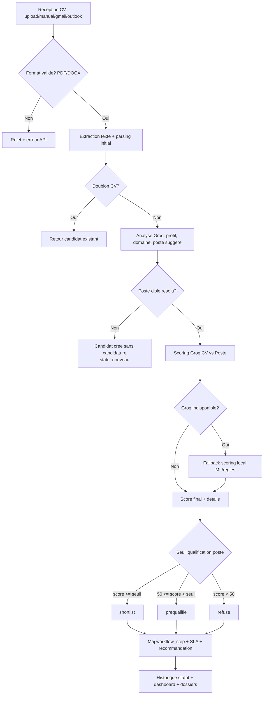

# Workflow recrutement (CV -> scoring -> statut) avec Groq

## Objectif

Standardiser un pipeline ATS robuste, explicable et evolutif, base sur:
- extraction CV,
- routing IA vers poste/domaine,
- scoring multi-strategie,
- progression de statut RH avec historisation.

## Diagramme cible

## Contrat fonctionnel des etapes

1. **Ingestion**
   - Endpoint principal: `POST /candidates/upload/`
   - Sources: `manual`, `gmail`, `outlook`
   - Controle fichier + anti-doublon par `texte_extrait`

2. **Parsing**
   - Extraction metadonnees candidat (nom, email, tel, skills, experience)
   - Creation de `Candidat` et `CV`

3. **Routing IA**
   - Groq recommande:
     - `poste_titre`
     - `domaine`
     - `confiance`
   - Mapping domaine vers `Domaine` en base

4. **Scoring**
   - Priorite:
     1) Groq (`score_cv_contre_poste_groq`)
     2) Fallback local (`calculer_score_avance` / ML)
   - Stockage de:
     - `score`
     - `score_details_json`
     - `explication_score`
     - `recommandation`

5. **Statut workflow**
   - Regles automatiques:
     - `shortlist` si `score >= score_qualification`
     - `prequalifie` si `50 <= score < score_qualification`
     - `refuse` si `< 50`
   - Derives:
     - `workflow_step`
     - `sla_due_at`

6. **Pilotage RH**
   - Progression manuelle via `PATCH /candidates/{id}/update/`
   - Historique: `CandidatureStatusHistory`
   - Monitoring: dashboard, funnel, SLA alerts, dossiers

## Checklist d'implementation (adaptee au projet)

- [x] Renommer fonctions coeur IA en `groq_*` (avec alias legacy `deepseek_*`)
- [x] Mettre a jour les appels backend vers les noms Groq
- [x] Conserver les cles de reponse legacy pour compatibilite frontend (`deepseekRouting`, `deepseek_error`)
- [ ] Ajouter des cles frontend natives Groq partout (`groqRouting`, `groq_error`) puis deprecier legacy
- [ ] Centraliser la politique fallback dans un helper unique (`groq_first_then_local`)
- [ ] Ajouter un champ `scoring_provider` en base (`groq`, `ml`, `rules`) pour audit
- [ ] Ajouter des tests API:
  - upload CV valide + scoring Groq
  - fallback quand Groq indisponible
  - transition statut + historisation
- [ ] Ajouter des seuils parametrables par poste (ex: seuil prequalif configurable)
- [ ] Ajouter idempotence renforcee sur emails/attachments (hash fichier + message_id)
- [ ] Ajouter logs techniques normalises (latence Groq, taux fallback, taux erreur)

## Conventions de nommage recommandees

- Fonctions:
  - `analyser_cv_groq`
  - `score_cv_contre_poste_groq`
  - `recommander_repartition_cv_groq`
- Champs API nouveaux:
  - `groqRouting`
  - `groq_error`
- Compatibilite transitoire:
  - garder `deepseekRouting` et `deepseek_error` en doublon jusqu'a migration frontend complete

## Strategie de migration frontend

1. Lire en priorite `groqRouting` / `groq_error`.
2. Si absents, fallback sur `deepseekRouting` / `deepseek_error`.
3. Apres 1-2 versions stables, retirer les cles legacy backend.
